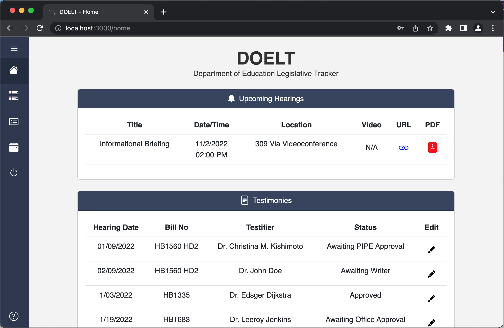

# Cassiopeia

# **Video Introduction**

<iframe width="560" height="315" src="https://www.youtube.com/embed/0rt54E251uU" title="YouTube video player" frameborder="0" allow="accelerometer; autoplay; clipboard-write; encrypted-media; gyroscope; picture-in-picture" allowfullscreen></iframe>

# **TABLE OF CONTENTS**

- [OVERVIEW](#OVERVIEW)
- [USER GUIDES](#USER_GUIDES)
- [TEAM MEMBERS](#MEMBERS)

# **OVERVIEW**

We created this legislative-tracking application for the Hawaii State Department of Education as part of the <b><a href = "https://hacc.hawaii.gov/hacc-judging-criteria/">2022 Hawaii Annual Code Challenge (HACC)</a></b>. The goal of this application is to not only help the HI DOE accomplish its mission but also to improve the educational environment for future Hawaii students.

This application was built using JavaScript, React, Meteor, and MongoDB.

# **USER GUIDES**

## **PAGES AND COMPONENTS**


<p style="text-align: center;">Log-in Page</p>


<p style="text-align: center;">Home Page</p>


<p style="text-align: center;">All Bills Page</p>


<p style="text-align: center;">DOE Bills Page</p>


<p style="text-align: center;">Edit Bill Page</p>


<p style="text-align: center;">Edit Testimony Page</p>

## **DEVELOPER’S GUIDE**

To download the source code, please head over to the [repository page](https://github.com/HACC2022/Cassiopeia) and download the master branch.

To run the app, navigate to the master branch directory in your terminal and open the `app` folder.

Make sure you have Meteor and Node installed to your system. Once these programs are installed, run the following commands in the app folder:

```
meteor npm install
```
```
meteor npm run start
```

Then navigate to <b><a href ="http://localhost:3000">http://localhost:3000</a></b> in your web browser.


If you'd like to modify the source code, it is recommended that you use [IntelliJ Idea](https://www.jetbrains.com/idea/) or a similar IDE.

# **MEMBERS**

<ul>
<li><b><a href = "https://acatarinaoaraujo.github.io/"  target="_blank">Ana Araujo</a></b></li>
<li><b><a href = "https://giorgio-tran.github.io/"  target="_blank">Giorgio Tran</a></b>
</li>
<li><b><a href = "https://khirano7.github.io/"  target="_blank">Kayla Hirano</a></b>
</li>
<li><b><a href = "https://robertgodfrey.github.io/"  target="_blank">Rob Godfrey</a></b>
</li>
<li><b><a href = "https://saitoshi.github.io/"  target="_blank">Shin Saito</a></b>
</li>
</ul>
